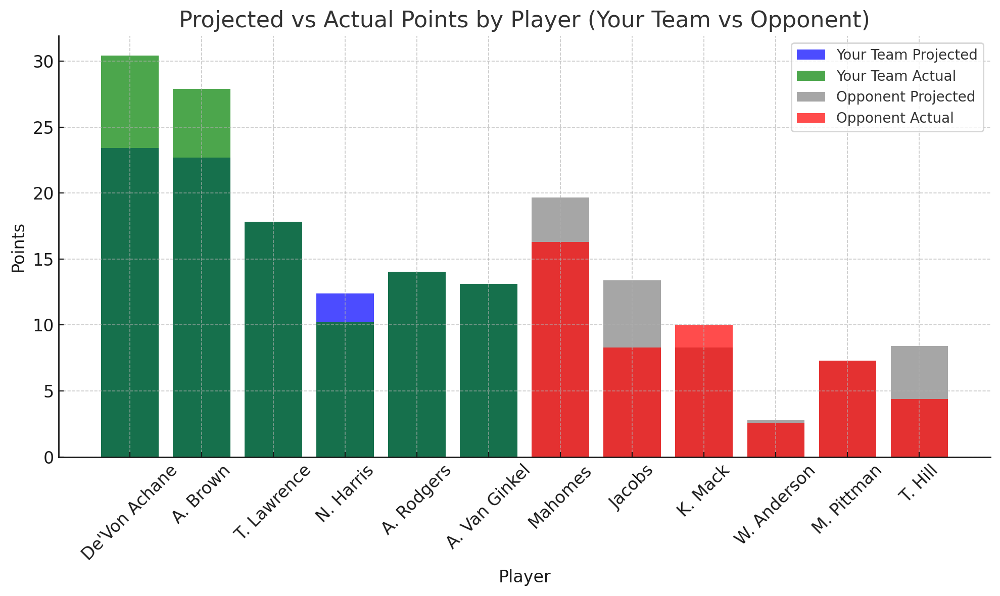
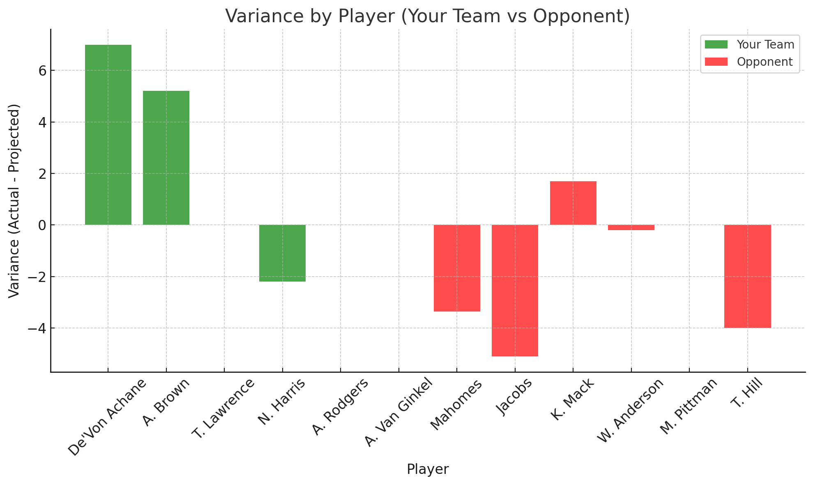
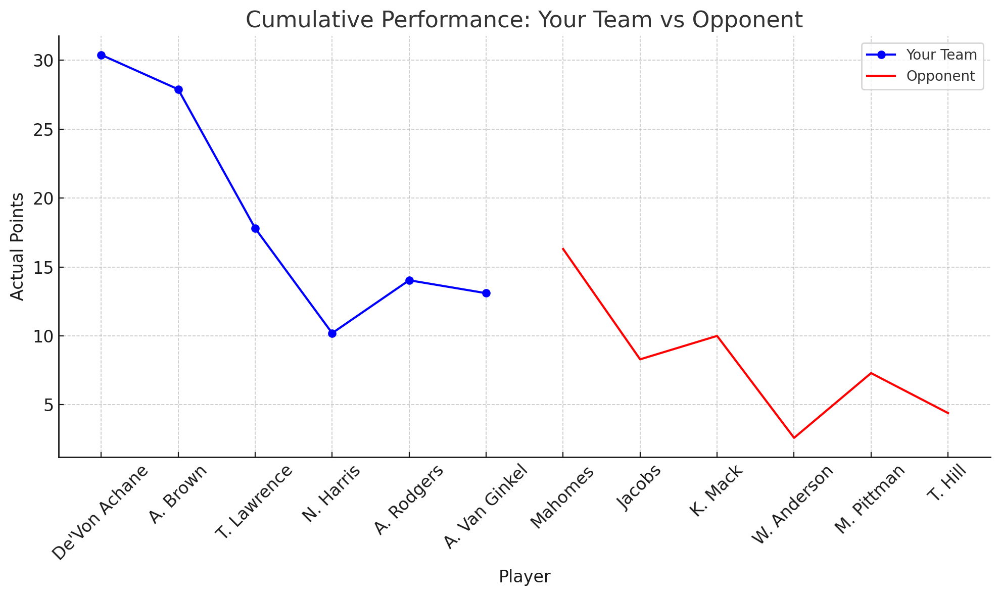
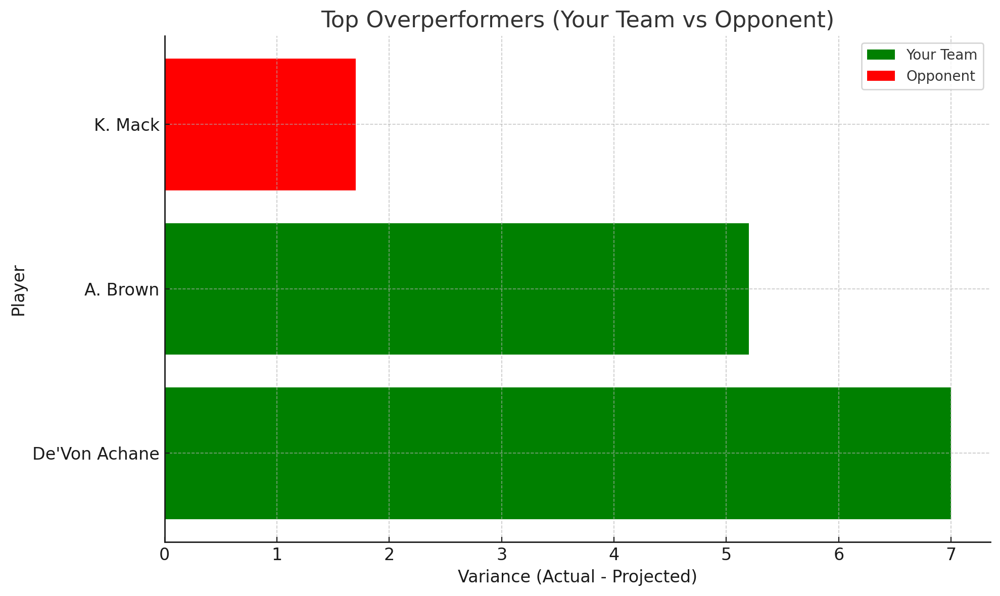

## Fantasy Football Data Analysis Project
This project was created to showcase my skills in data analysis, particularly in the context of Fantasy Football. By analyzing player performance, projections, and actual results, I demonstrate how data insights can drive decisions. The goal of this project is to perform an in-depth analysis of a fantasy football matchup, comparing player projections against actual performances, and providing insights that can help fantasy managers optimize their lineups.

The project includes various data visualizations that highlight key findings, which are included to give a comprehensive overview of player performance by position and matchups.

## Data and Tools
Data Source: Fantasy Football data with player projections and actual scores via Sleeper API.
https://docs.sleeper.com/

Libraries: Pandas for data manipulation, Matplotlib for visualizations.
Tools: Python for scripting and automating data analysis tasks.

## Usage

To analyze your own data:

Input the player projections and actual scores.
Run the analysis scripts to generate insights and charts.
Use the visualizations and data to optimize fantasy football decision-making.

## Visualizations and Insights

# 1. Projected vs Actual Points by Position

This chart compares the projected and actual points for each position (QB, WR, RB, etc.).

Analysis:

Wide receivers (WR) were the top performers, significantly exceeding their projections by a combined +12.20 points for my team.
De'Von Achane (RB), on my team, also performed above expectations, contributing +7.00 points beyond his projection.
Opponent’s Quarterback (QB) and Running Back (RB) underperformed, leading to a total variance of -8.47 points.
Defensive Line (DL) for both teams met or slightly exceeded expectations.
Key Takeaway: My team’s wide receivers and De'Von Achane were pivotal in outscoring the opponent, while the opponent's QB and RB underperformance contributed to their loss.

# 2. Variance by Position

This chart shows the variance between actual and projected points for each position, illustrating where the largest over- and under-performance occurred.

Analysis:

Wide receivers (WR) accounted for the highest positive variance on my team, while the opponent’s QB and RB showed significant negative variance.
Defensive Line (DL) for my team performed slightly better than projected, while for the opponent, it matched expectations.

De'Von Achane (RB) provided another large positive variance, significantly boosting my team’s total points.

Key Takeaway: Understanding variance at the positional level helps identify strengths and weaknesses in the lineup. My WRs outperformed projections, while the opponent's key positions underperformed.

# 3. Cumulative Performance: My Team vs. Opponent

This cumulative performance chart compares player scores throughout the matchup.

Analysis:

My team consistently outscored the opponent, with spikes in performance from De'Von Achane and AJ Brown, which were crucial in maintaining a lead.
The opponent’s team, particularly Mahomes and Jacobs, fell short, contributing to a flatter performance curve overall.

Key Takeaway: My team consistently outperformed the opponent across multiple positions, and the performance peaks for wide receivers provided a decisive advantage.

# 4. Top 5 Overperformers

This bar chart highlights the top 5 players who exceeded their projected points.

Analysis:

D. Achane (WR) led with a +7.00 point variance, followed by AJ Brown (WR) with +5.20 points.
These players were critical to my team’s success, adding significant value beyond their initial projections.

Key Takeaway: Investing in wide receivers and running backs paid off in this matchup, as they significantly outperformed expectations and contributed to the win.

# 5. Top 5 Underperformers

![Alt text])

This chart identifies the players who performed below their projections.

Analysis:

Josh Jacobs (RB) was the biggest underperformer, falling short of his projection by -5.10 points, negatively impacting the opponent’s score.

Taysom Hill (WR), also on the opponent's team, underperformed by -4.00 points, further hurting their overall performance.

Key Takeaway: Despite some underperformance on both sides, the opponent’s major shortfall in key positions like RB contributed heavily to their loss.

##  Bench and Lineup Analysis

# Bench Projected vs Actual Points 

This chart compares the projected and actual points for both teams, showing how players performed relative to their projections. Several key insights stand out:

Joe Mixon (RB): Mixon had a huge game, scoring 30.60 points, far exceeding his projected 13.83 points. Had he been started instead of another running back, this could have provided a significant boost to my total score. This resulted in a +16.77 point variance, one of the largest missed opportunities.

Aaron Rodgers (QB): Although Aaron Rodgers was projected to score 22.38 points, he only scored 14.04 points, leading to an underperformance of -8.34 points. Keeping him on the bench was a wise decision, as he didn't meet his high projections.

Devin Singletary (RB) - Go Giants! : Singletary performed well, scoring 9.60 points, which was close to his projection of 11.61 points. While he didn't outperform his projection, the decision to bench him did not result in significant missed points.

J Simmons (Starter): Simmons underperformed slightly, scoring 2.50 points compared to his projected 2.74 points. However, the difference here is minimal, and starting him was a sound choice.

K. Murray (Starter): Murray slightly underperformed, scoring 1.50 points against a projection of 2.79 points, but again, this decision didn't lead to a significant missed opportunity.

# 2. Variance in Points (My Team vs Opponent)

This chart highlights where players exceeded or fell short of their projected points:

Top Overperformers:

J. Mixon (Bench) had the largest positive variance with +16.77 points over his projection, indicating a significant missed opportunity.
J. McMillan (Opponent): McMillan outperformed expectations with a +2.48 point variance, scoring 10.20 points over a projected 7.72 points.
Top Underperformers:

Aaron Rodgers (Bench): With an underperformance of -8.34 points, Rodgers' actual score of 14.04 was well below his 22.38 point projection. Keeping him on the bench was a correct decision.
T. Johnson (Starter): Johnson's actual points came in at only 0.20 compared to his projection of 2.74, showing a significant underperformance.
T. Tuipulotu (Opponent): Tuipulotu failed to score any points despite a projected 3.22, which helped to keep my opponent's score lower

## Conclusion

This project demonstrates my ability to take raw data (in this case, fantasy football player projections and actual scores), analyze it, and generate valuable insights through visualizations. The analysis highlights over- and under-performing players, identifies trends, and offers recommendations for optimizing future matchups (Also that I'm the best fantasy football player at this bank :) ).

This framework can be applied to other areas of data analysis, such as customer behavior, financial modeling, or performance analytics, demonstrating my readiness for roles that require data-driven decision-making.